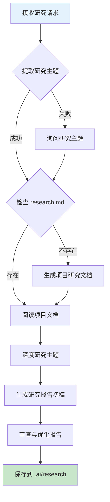
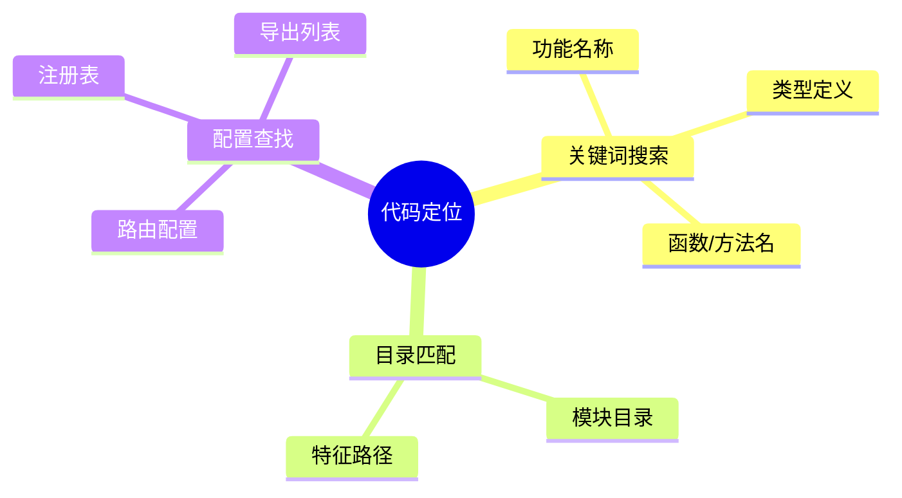
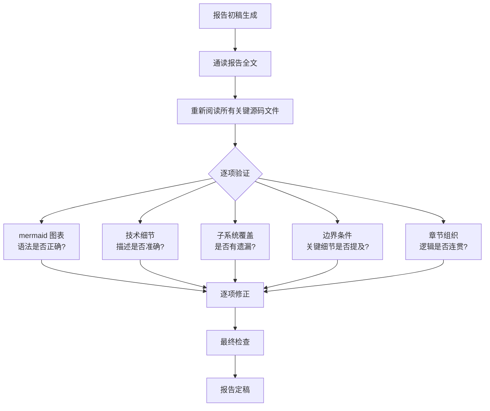

# Code Project Research

对代码项目的特定功能进行深度研究，生成包含详细可视化图表的研究报告。

## 快速开始

### 使用流程



### 核心步骤

1. **提取研究主题**

   - 从用户请求中识别研究主题（功能名、模块名）
   - 无法提取时询问用户
2. **检查项目文档**

   - 检查 `.ai/research.md` 是否存在
   - 不存在则先生成项目整体研究文档
3. **深度主题研究**

   - 定位相关代码文件
   - 分析核心实现逻辑
   - 理解架构和设计
   - 研究过程根据项目复杂程度合理判断，复杂项目使用 agents 并行研究，但不要同时超过 3 个
4. **生成研究报告**

   - 使用模板组织内容
   - 报告应以详细易懂的文字说明为主，仅复杂概念和过程需要绘制图表
   - 使用 mermaid 绘制可视化图表
5. **审查与优化报告**

   - 对照源码逐项验证准确性（类名、函数名、调用路径、类型签名）
   - 检查 mermaid 图表语法和逻辑
   - 补充遗漏的子系统、工具类、边界细节
   - 修正不准确的描述和重复内容
6. **保存报告**

   - 保存到 `.ai/research/{主题}.md`

## 研究主题提取

### 识别模式

从用户请求中提取研究主题：

**明确主题**（直接提取）:

- "请研究 **subagent** 功能" → `subagent`
- "分析 **skills** 的实现" → `skills`
- "探索 **LSP** 集成" → `lsp`

**隐含主题**（语义推断）:

- "研究子代理的实现" → `subagent`
- "分析技能系统架构" → `skills`
- "理解语言服务器集成" → `lsp`

**模糊主题**（询问用户）:

- "请研究这个功能"
- "分析一下那个模块"

**询问模板**:

```
请问您想研究哪个具体的功能或模块？
例如：subagent、skills、lsp、tool 等
```

## 项目整体研究

### 检查 research.md

```bash
# 检查文件是否存在且有内容
test -f .ai/research.md && test -s .ai/research.md
```

### 生成项目文档

如果 research.md 不存在，执行项目整体研究：

**研究内容**:

- 项目概述：名称、用途、特点
- 技术栈：语言、框架、工具
- 目录结构：代码组织方式
- 核心架构：分层、设计模式
- 主要模块：功能列表、关键文件

**保存位置**: `.ai/research.md`

## 主题深度研究

### 代码定位策略



**搜索技巧**:

```bash
# 1. 关键词搜索
grep -r "subagent" packages/opencode/src/

# 2. 目录匹配
find . -type d -name "*skill*"

# 3. 类型定义
grep -r "interface.*Agent" packages/

# 4. 导出查找
grep -r "export.*Skill" packages/
```

### 理解实现逻辑

**三层理解**:

1. **表层**: 这个代码做什么？

   - 功能职责
   - 输入输出
   - 边界条件
2. **深层**: 如何实现的？

   - 算法逻辑
   - 设计模式
   - 技术选型
3. **本质**: 为什么这样设计？

   - 设计理念
   - 架构权衡
   - 技术亮点

## 可视化设计

### 图表选择指南

根据信息类型选择合适的图表：

| 信息类型 | 推荐图表         | 使用场景               |
| -------- | ---------------- | ---------------------- |
| 系统架构 | flowchart (子图) | 展示分层架构、模块关系 |
| 执行流程 | flowchart        | 展示步骤、决策、分支   |
| 交互序列 | sequenceDiagram  | 展示调用顺序、数据交换 |
| 状态转换 | stateDiagram-v2  | 展示状态变化、生命周期 |
| 类型关系 | classDiagram     | 展示类结构、继承关系   |
| 层次分类 | mindmap          | 展示功能分类、知识体系 |
| 依赖关系 | graph            | 展示模块依赖、调用关系 |

### 绘制要点

**架构图**: 使用子图分层，标注主要接口，明确数据流向

**流程图**: 覆盖主要分支，节点表达明确，决策条件清晰

**时序图**: 角色身份明确，时间顺序正确，交互完整清晰

**状态图**: 状态完整覆盖，转换条件明确，生命周期清晰

详细参考：[Mermaid 图表绘制指南](mermaid-guide.md)

## 报告生成

### 报告结构

使用标准报告模板：

**必需章节**:

1. 概述 - 功能定义与核心特性
2. 核心架构 - 系统架构与模块关系
3. 关键组件 - 核心组件详解
4. 数据结构 - 类型定义与数据流
5. 核心流程 - 执行流程与交互
6. 总结 - 核心优势与价值

**可选章节**:

- 状态管理 - 状态结构与生命周期
- 集成关系 - 模块集成与接口
- 设计模式 - 模式应用与实现
- 代码示例 - 典型使用场景
- 最佳实践 - 开发指南与清单

详细参考：[研究报告模板](research-template.md)

## 报告审查与优化

生成报告后，**必须**执行一轮系统性的审查，对照实际源码验证准确性并补充遗漏。这是保证报告质量的关键步骤，不可跳过。

### 审查流程



### 审查要点

**逐项验证** — 对照源码，逐个核实报告中的每项声明：

- 类名、函数名、文件路径是否正确
- API 签名、参数类型是否匹配
- 调用关系图是否反映真实代码路径
- 各模块之间的依赖关系是否正确

**补充遗漏** — 检查是否遗漏了重要的子系统或文件：

- 是否有未被提及的源码文件（通过 `find`/`ls` 列出所有文件）
- 是否有重要的内部实现细节被跳过
- 辅助工具类（utils、helpers）是否被忽略
- 测试文件是否暴露了值得记录的边界行为

**修正不准确** — 常见的问题类别：

- 时序图中的调用路径与代码实际路径不一致（如中间层被跳过或错误连接）
- 数据结构的字段说明与类型定义不符
- 算法描述的步骤与实际代码逻辑有偏差
- 重复或矛盾的表述（文字残留）

**Mermaid 语法验证** — 确保图表可以正常渲染：

- 节点引用名是否与定义一致
- 子图嵌套是否正确
- 特殊字符是否正确转义（如括号、引号）
- 箭头语法是否有效

### 质量标准

**内容完整性**:

- 覆盖主要功能
- 架构清晰完整
- 流程准确无误
- 图表表达准确

**可视化质量**:

- 图表类型合适
- 语法正确无误
- 样式统一美观
- 标注完整清晰

**文档规范性**:

- 结构清晰合理
- 代码引用正确
- 格式符合规范
- 可读性强

## 保存与交付

### 文件保存

**路径规则**: `.ai/research/{主题}.md`

**命名规范**:

- 小写字母
- 连字符分隔
- 与主题一致

示例: `subagent.md`, `skills.md`, `lsp.md`

### 质量检查

**交付前检查清单**:

- [ ] 研究主题准确
- [ ] 覆盖主要功能
- [ ] 图表清晰完整
- [ ] 代码引用正确
- [ ] Markdown 格式正确
- [ ] Mermaid 语法正确
- [ ] 有深度见解
- [ ] 可读性强

## 参考资源

完整的代码研究指南和参考资料：

- [研究报告模板](research-template.md) - 标准报告结构和格式
- [Mermaid 图表指南](mermaid-guide.md) - 可视化图表绘制方法
- [代码研究方法论](research-methodology.md) - 完整的研究流程和技巧

## 使用示例

### 示例 1：研究 SubAgent 功能

**用户请求**: "请研究 opencode 的 subagent 子代理功能"

**执行流程**:

1. 提取主题: `subagent`
2. 检查 `.ai/research.md`
3. 阅读 research.md 了解项目
4. 搜索 `subagent` 相关代码
5. 分析实现逻辑
6. 生成研究报告
7. 保存到 `.ai/research/subagent.md`

### 示例 2：研究 Skills 系统

**用户请求**: "对 opencode 的 skills 技能功能做深度研究"

**执行流程**:

1. 提取主题: `skills`
2. 检查 `.ai/research.md`
3. 阅读 research.md
4. 搜索 `skills` 相关代码
5. 分析技能发现、加载、执行机制
6. 绘制架构图、流程图、时序图
7. 保存到 `.ai/research/skills.md`

### 示例 3：项目整体研究

**用户请求**: "阅读当前项目，做一个深度、全面的研究"

**执行流程**:

1. 检查 `.ai/research.md` - 不存在
2. 执行项目整体研究
3. 生成 `.ai/research.md`
4. 包含：概述、技术栈、架构、模块
