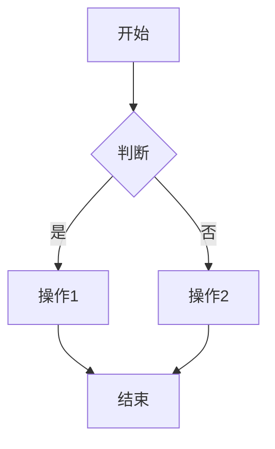
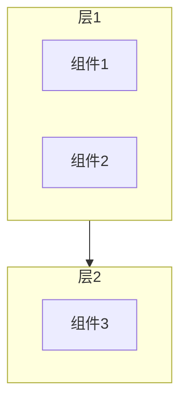
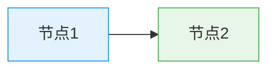
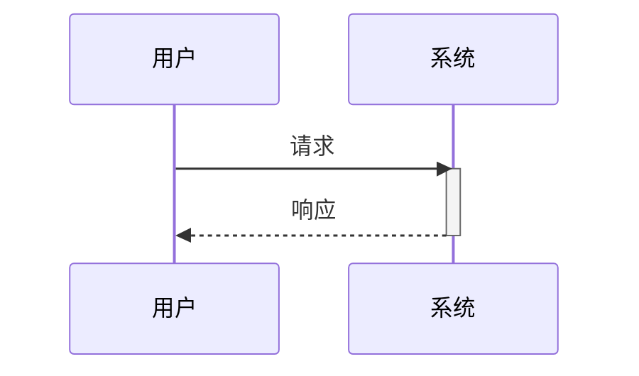
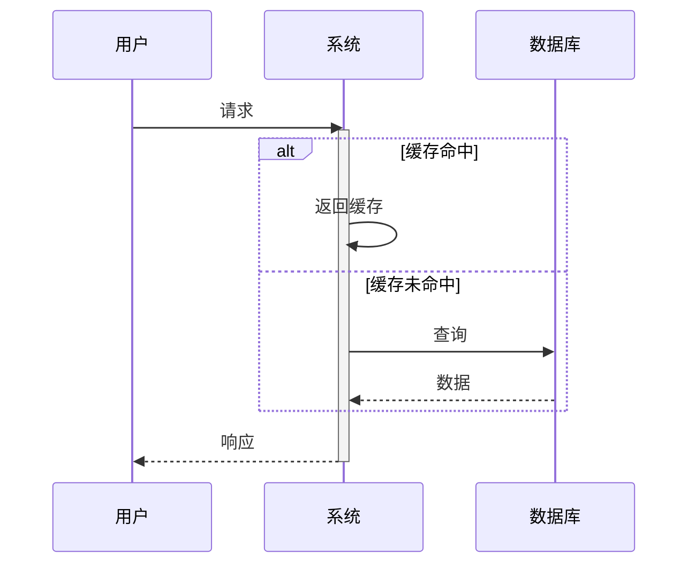
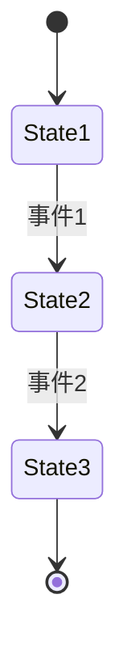
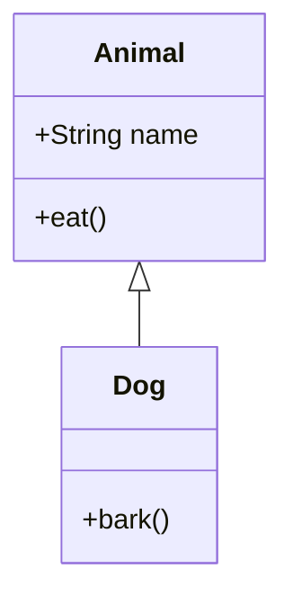
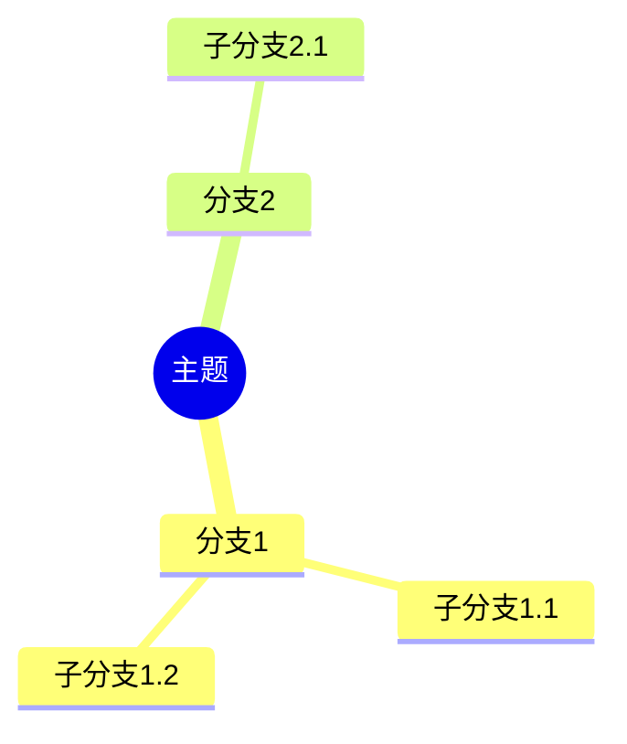

# Mermaid 图表绘制指南

## 快速参考

| 图表类型 | 适用场景 | 语法 |
|---------|---------|------|
| 流程图 | 展示流程、步骤 | `flowchart TD` / `flowchart LR` |
| 时序图 | 展示交互顺序 | `sequenceDiagram` |
| 状态图 | 展示状态转换 | `stateDiagram-v2` |
| 类图 | 展示类结构 | `classDiagram` |
| 思维导图 | 展示层次 | `mindmap` |

## 流程图

### 基础

### 子图

### 样式

## 时序图

### 基础

### 高级

## 状态图

## 类图

## 思维导图

## 颜色参考

- 蓝色: `#e3f2fd` (背景), `#2196f3` (边框)
- 绿色: `#e8f5e9` (背景), `#4caf50` (边框)
- 橙色: `#fff4e1` (背景), `#ffa726` (边框)
- 红色: `#ffebee` (背景), `#f44336` (边框)
- 紫色: `#f3e5f5` (背景), `#9c27b0` (边框)

## 最佳实践

1. **简洁明了** - 一个图表表达一个核心概念
2. **样式统一** - 使用一致的颜色和样式
3. **标注完整** - 添加必要的注释和说明
4. **节点清晰** - 使用明确的节点名称
5. **层次清晰** - 合理使用子图和分组

参考：[Mermaid 官方文档](https://mermaid.js.org/)
