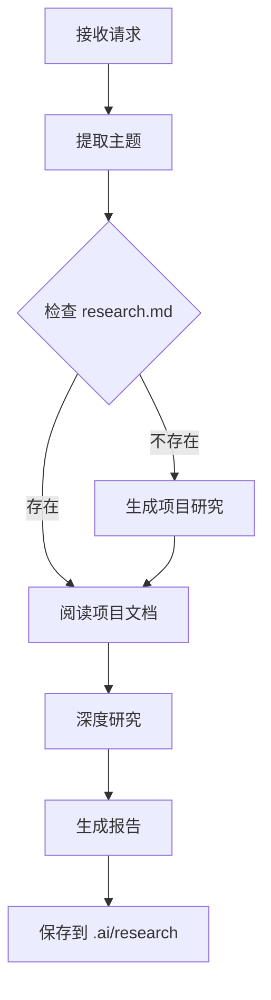

# 代码研究方法论

## 研究流程



## 第一步：提取研究主题

### 识别模式

**明确主题**:
- "研究 subagent 功能" → `subagent`

**隐含主题**:
- "研究子代理" → `subagent`

**模糊主题**: 需要询问用户

## 第二步：检查项目文档

### 检查 research.md

```bash
test -f .ai/research.md && test -s .ai/research.md
```

### 生成项目文档（如不存在）

研究内容：
- 项目概述
- 技术栈
- 目录结构
- 核心架构
- 主要模块

## 第三步：深度研究

### 代码定位

```bash
# 1. 关键词搜索
grep -r "主题" packages/

# 2. 目录匹配
find . -type d -name "*关键词*"

# 3. 类型定义
grep -r "interface.*类型" packages/

# 4. 导出查找
grep -r "export.*模块" packages/
```

### 三层理解

1. **表层**: 做什么？
2. **深层**: 怎么做？
3. **本质**: 为什么？

## 第四步：可视化

### 图表选择

- 架构 → flowchart (子图)
- 流程 → flowchart
- 交互 → sequenceDiagram
- 状态 → stateDiagram-v2
- 类型 → classDiagram
- 层次 → mindmap

## 第五步：生成报告

### 结构

必需：概述、架构、组件、数据结构、流程、总结

可选：状态管理、集成关系、设计模式、示例、最佳实践

### 质量标准

- ✅ 覆盖主要功能
- ✅ 图表清晰
- ✅ 代码准确
- ✅ 有深度见解

## 保存

路径: `.ai/research/{主题}.md`

命名: 小写、连字符、与主题一致

## 技巧

### 高效研究

1. 先理解后深入
2. 自顶向下分析
3. 图表先行

### 质量保证

1. 验证代码位置
2. 测试图表渲染
3. 交叉验证信息
