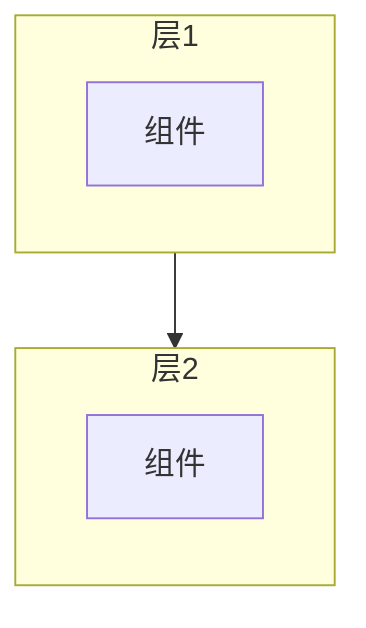
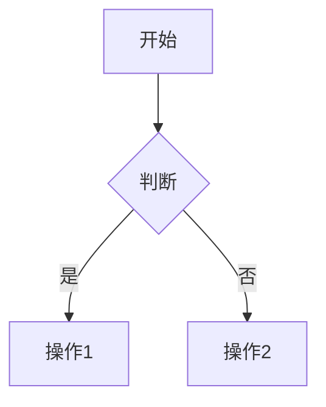
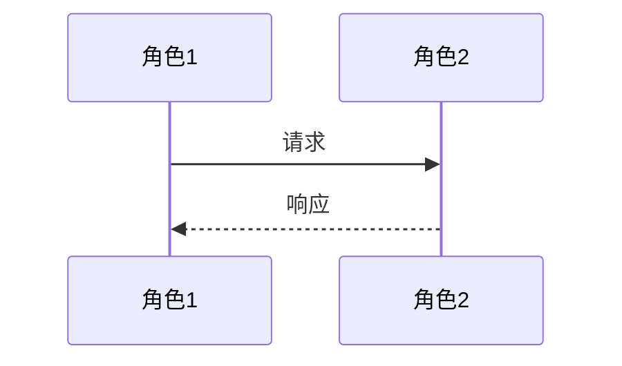
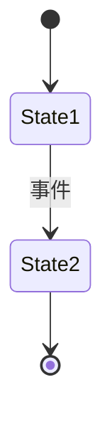
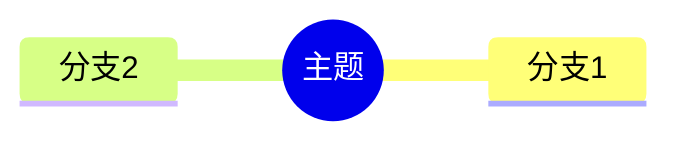

# 研究报告模板

> 使用此模板生成统一格式的代码研究报告

## 报告结构

### 必需章节

1. **概述** - 功能定义、核心特性、应用场景
2. **核心架构** - 系统架构图、模块依赖、代码组织
3. **关键组件** - 组件清单、组件详解
4. **数据结构** - 类型定义、数据流
5. **核心流程** - 执行流程、时序图、状态图
6. **总结** - 核心优势、架构评价

### 可选章节

- 状态管理
- 集成关系
- 设计模式
- 代码示例
- 最佳实践

## Mermaid 图表使用

### 架构图



### 流程图



### 时序图



### 状态图



### 思维导图



详细参考：[Mermaid 图表指南](mermaid-guide.md)

## 代码引用格式

```typescript
// 文件位置: path/to/file.ts:行号

class ClassName {
  // 关键方法
  method() {
    // 实现
  }
}
```

## 表格使用

| 组件 | 文件 | 职责 |
|------|------|------|
| 组件A | path/a.ts | 说明 |
| 组件B | path/b.ts | 说明 |

## 质量检查清单

- [ ] 研究主题准确
- [ ] 覆盖主要功能
- [ ] 图表清晰完整
- [ ] 代码引用正确
- [ ] Mermaid 语法正确
- [ ] 有深度见解
